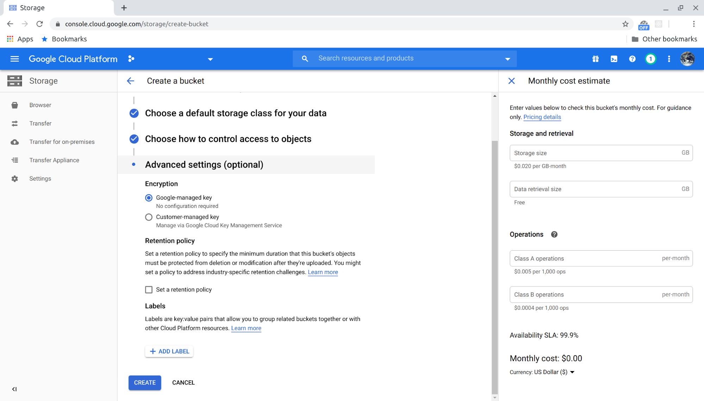

# USim Cloud Data Transfer

This guide will show you how to transfer your simulation data from USim to your own custom bucket. 

**Only GCS bucket destinations are supported at this time.**

## Prerequisites

### USim Prerequisites
To use USim data transfer features, one needs to make sure all USim prerequisites are met.
USim prerequisites can be found [HERE](https://github.com/Unity-Technologies/Unity-Simulation-Docs).

USim data transfer feature allows you to transfer data from your own project to a custom
GCS bucket within region `us-central1`. If your destination is in other region, please reach out to *simulation-help@unity3d.com* and request to add your project ID to our allowlist. 

### Google Cloud Storage
Assuming simulations were run successfully and data was generated, one needs to have access to Google Cloud Storage (GCS) and must create a bucket as the data transfer destination.

#### GCS Access

1. A Google account is required. [Sign up](https://accounts.google.com/signup/v2/webcreateaccount?hl=en&flowName=GlifWebSignIn&flowEntry=SignUp) if you need to create a new account.
2. Access [GCS](https://cloud.google.com/storage) by logging in to Google Cloud Platform (GCP) Console using your Google account. If you haven’t set up GCP already, simply follow instructions to set it up. A GCP project will be created and you should be able to access GCS in your project.

#### Create GCS Bucket
One needs to create a bucket as the destination for data transfer. Click “Create Bucket” on GCS browser page:

Give a name to your bucket:

Choose a region for your bucket. It is important to choose **“Region”** for location type and **“us-central1”** for location, because that’s the USim internal bucket location. Data transfer between buckets in the same location is the fastest with lowest cost.

Choose a storage class for your bucket. Typically “Standard”, unless there is special need for other storage classes. Different storage classes cost differently.

 
Choose access control type. Leave it to use default type.

Advanced settings. You can simply use default settings. 

Finally, click **“Create”** and your bucket should be ready in a moment.

#### Grant Permission
There are 2 service accounts need to access your destination bucket. Follow these steps to grant permissions.

1. Click the bucket you just created and choose the “Permissions” tab

    

2. Add USim service account **“project-787244313480@storage-transfer-service.iam.gserviceaccount.com”** as a member of the bucket and assign **“Storage Legacy Bucket Writer”** role. This service account is an internal service account used by Google Storage Transfer service to perform transfer operations.  
    
    Also add USim service account **“bhram-prd-usc1-datatransfer@unity-ai-bhram-prd.iam.gserviceaccount.com”** as a member of the bucket and assign **“Storage Legacy Bucket Reader”** role. This service account is a USim service account that validates your destination bucket.  
    
    

3. Now your bucket is ready to receive data from USim.

## Use USim Data Transfer
REST APIs are provided to create a data transfer job and get status of the transfer job. The USim Swagger API documentation for Data Transfer APIs can be found [HERE](https://api.simulation.unity3d.com/swagger/index.html).
