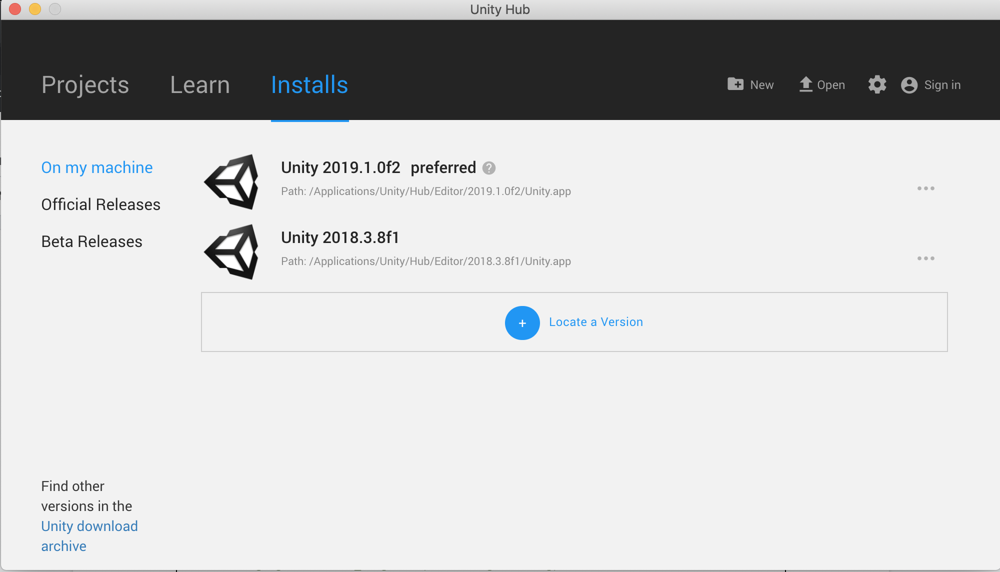
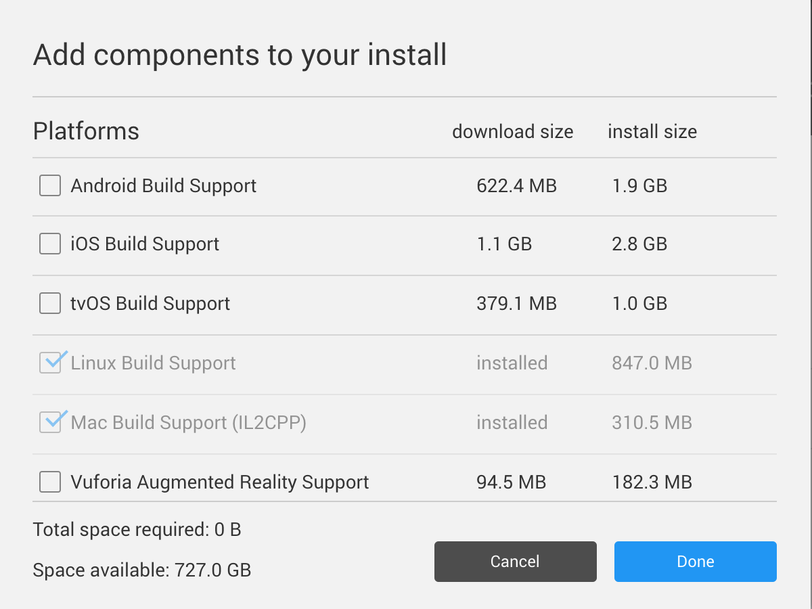

# Unity Simulation Requirements
- Unity Account
- Unity Cloud Project
- Unity version >= 2018.4 (>= 2019.3 for [SRP](https://docs.unity3d.com/Manual/ScriptableRenderPipeline.html) support)
- Supported platforms: Windows10+ and OS X 10.13+
- Linux build support required

## Unity Account
A Unity account is required to submit simulations to the Unity Simulation service.

## Unity Cloud Project
A Unity Cloud Project Id is required to use Unity Simulation. Please reference the [Setting up your project for Unity Services](https://docs.unity3d.com/Manual/SettingUpProjectServices.html) for instructions on how to enable Unity Cloud Services for a project and how to find the Cloud Project Id.

## Unity Version

We recommend you install [Unity Hub](https://docs.unity3d.com/Manual/GettingStartedInstallingHub.html) to install and manage your Unity versions.

Unity version 2018.3 and above is required. To install a new Unity version using Hub navigate to the Installs tab and select Official Releases.

## Steps to install Linux build support

Note: When installing a new version be sure that Linux Build Support is enabled.

To install Linux build support open Unity Hub and navigate to the Installs tab.

Click on the options menu icon, (...) to the right of your project’s Unity version, and select Add Component.

Ensure that Linux Build Support is checked in the components menu and click done to begin the install.

